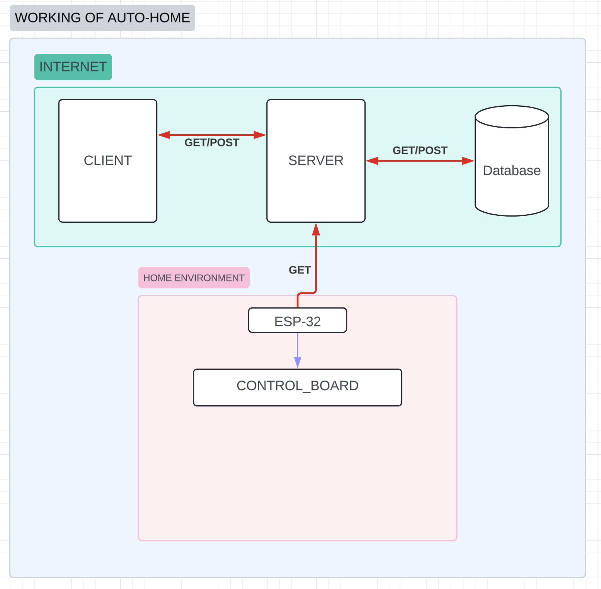

# Home_Automation
A project for home automation. This is the dummy project of the original, some code changes have been made for the purpose of data security. Developers tryping to copy this project just have to make minor changes to adjust this to there own requirements.

## Description
welcome to this project where I have combined the <b> Electronics </b> of a house with my <b>Computer Science </b> knowledge to automate it.  
I coded the ESP-32 a System On a Chip (SOC) connected to a relay module along with a website that updates the data on a MongoDB server.

## Features

## Tools, Libraries and Frameworks used 
<b>FRONTEND: </b>
1. Vite
2. @tanstack/react-query
3. axios
5. react-router-dom
8. react-hot-toast
<!-- 9. Tailwindcss as Postcss -->

<b>BACKEND: </b>
1. bcryptjs
2. cors
3. express
4. mongoose
5. nodemon

<b>HARDWARAE: </b>
1. ESP-32 
2. Relay Modules

## Project Plan

## Make this project your own and automate the home.
##### follow the following simple steps...