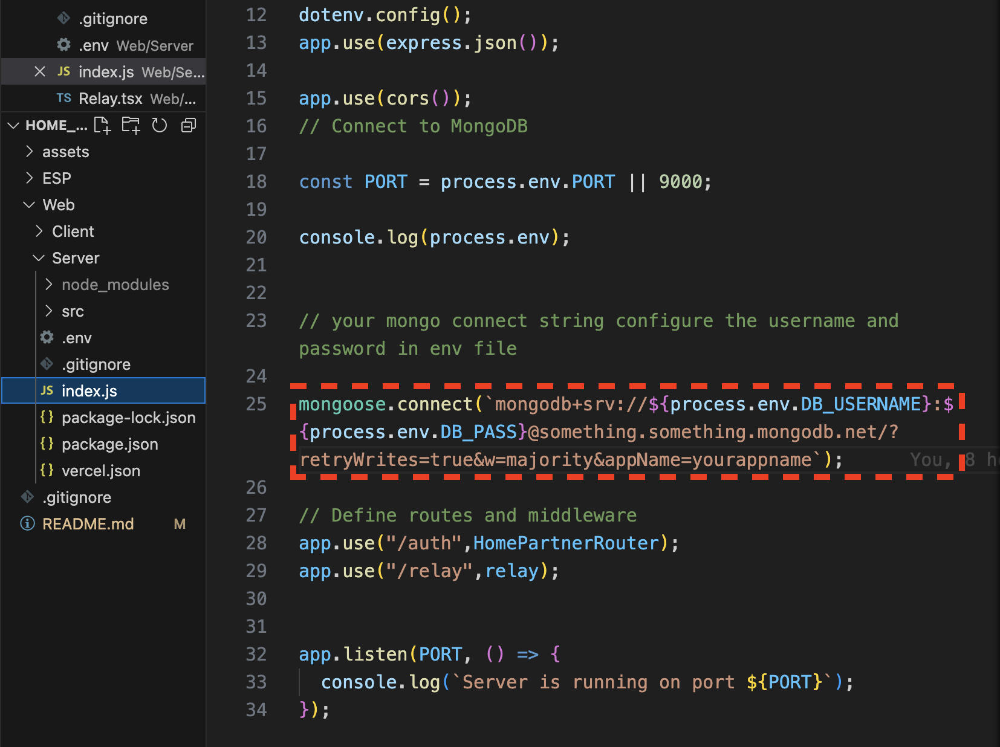
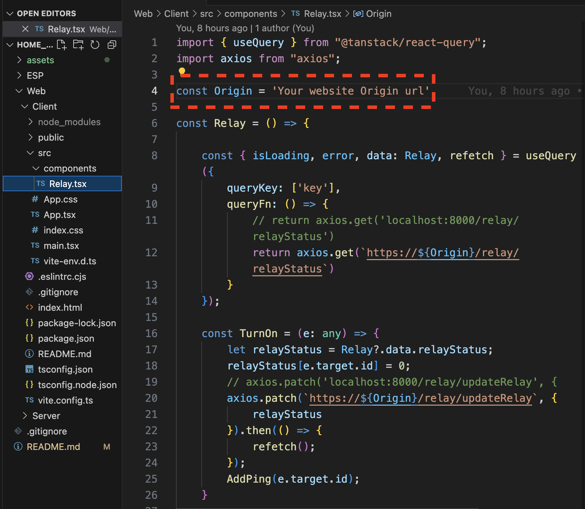
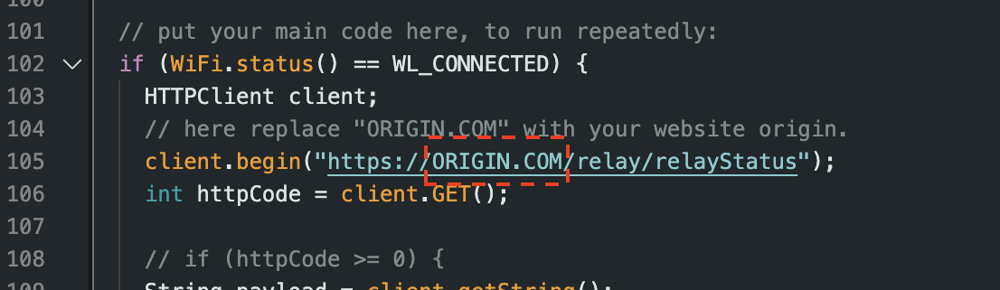
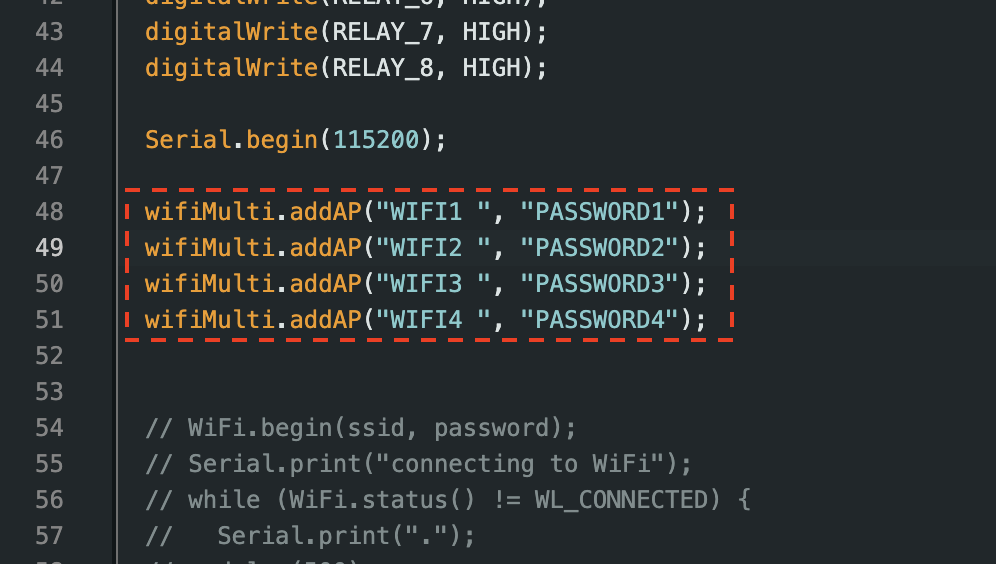
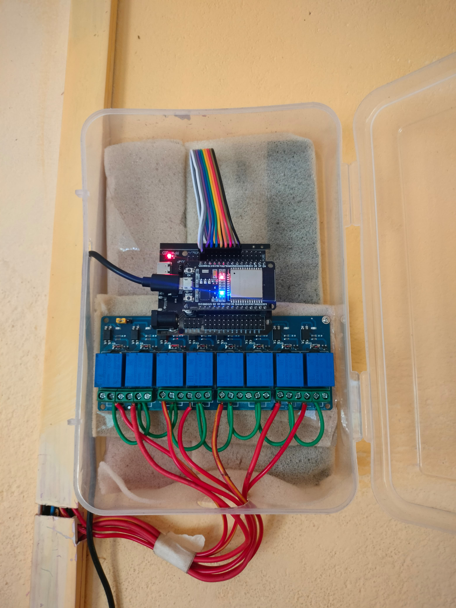

# Home_Automation
A project for home automation. This is the dummy project of the original, some code changes have been made for the purpose of data security. Developers tryping to copy this project just have to make minor changes to adjust this to there own requirements.

## Description
welcome to this project where I have combined the <b> Electronics </b> of a house with my <b>Computer Science </b> knowledge to automate it. <br/>
I coded the ESP-32 a System On a Chip (SOC) connected to a relay module along with a website that updates the data on a MongoDB server.

## Features

## Tools, Libraries and Frameworks used 
<b>FRONTEND: </b>
1. Vite
2. @tanstack/react-query
3. axios
5. react-router-dom
8. react-hot-toast
<!-- 9. Tailwindcss as Postcss -->

<b>BACKEND: </b>
1. bcryptjs
2. cors
3. express
4. mongoose
5. nodemon

<b>HARDWARAE: </b>
1. ESP-32 
2. Relay Modules


## Project Plan


## Make this project your own and automate the home.
### follow these simple steps...

1. **Download the code from this Repository.**

2. **Configuring Backend...** 
    - Install required dependencies <br/><br/>
    Move to the web folder and on the terminal paste the following command to install all required libraries.
<br/><br/>
    ```bash
    npm install
    ```

    - Connect the MongoDB <br/><br/>
    <br/><br/>  <br/><br/>
     here add your database connection string in same format and remember the username and password from mongo.

    - Configure the env file
     In the env file place your username, password, port number and the hashing number (recommended 8-12).
     Do the same when deploying by providing these as environment variables.
    
3. **Configuring Frontend...**

    - Putting in origin URL. <br/><br/>
     Move to the components folder under src in Client and open Relay.tsx file. Now under the Origin field paste your URL origin where Backend was deployed.
     example : Home_automation_Backend.com
   <br/><br/> 

4. **Configure the ESP32 code.**

    - Putting in origin URL.
   <br/><br/>  <br/><br/>
    Remove this part and paste your URL origin where Backend was deployed. Similar to the previous part.

    - Adding WIFI credentials.
   <br/><br/>  <br/><br/>
    Add your network details here.

    - Setting up ESP32 and relay. <br/><br/>
    Connect the relay pins to same pins mentioned in the code.


## Final project preview

